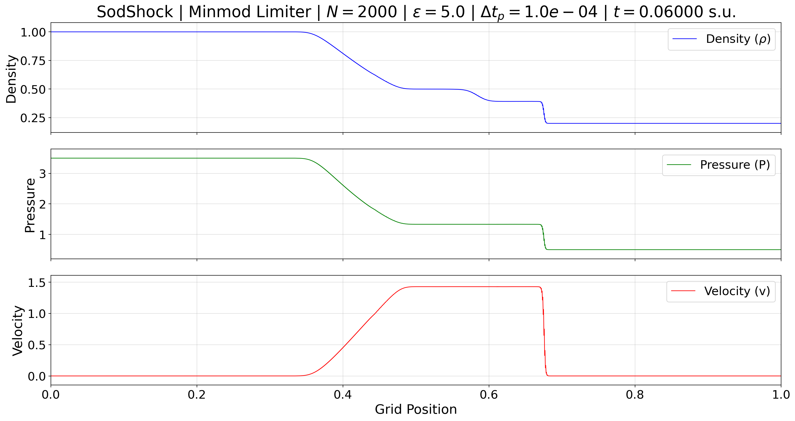

# **1D Shock Simulations with Configurable Numerical Schemes**

This project implements a numerical simulation of the classic Sod shock tube problem and a supernova explosion both in one dimension using the Euler equations for gas dynamics. The code allows users to select from various numerical schemes and configure diverse simulation parameters and initial conditions through configuration files and command-line arguments. It also includes tools for analyzing shock properties like Mach number and shock speed.

## **Key Features**

*   **Multiple Implemented Numerical Schemes:**
    *   Lax-Friedrichs (LF)
    *   Lax-Wendroff-Ritchmyer (LWR)
    *   Flux Limiter Scheme (Minmod)
*   **Highly Flexible Configuration:**
    *   **General Simulation Parameters:** Controlled via `simulation_config.ini` (e.g., default scheme, number of cells, CFL, epsilon smoothing factor, output settings, plot update frequency, frame saving frequency, analysis times `t_measure1`, `t_measure2`).
    *   **Specific Initial Conditions:** Defined in `ic_config_*.ini` files (e.g., `ic_config_sod.ini`, `ic_config_SN.ini`), allowing for different problem scenarios.
    *   **`simulation_name_keyword`:** A unique identifier for each initial condition file (set within the `.ini` file) or via command line (`-snk`). This keyword is used as the primary prefix for output filenames and the default output directory name. Default: "NumSche".
    *   **Command-Line Overrides:** Most configuration parameters can be directly overridden when executing the scripts.
*   **Dynamic and Detailed Visualization (`main_simulation.py`):**
    *   Real-time animation of the evolution of density (ρ), pressure (P), and velocity (v).
    *   Plot Y-axis limits adjust dynamically to encompass the full data range.
    *   The plot title displays relevant simulation information: simulation keyword, time, scheme, cell count, epsilon, and plot update interval.
*   **Organized Output of Results (`main_simulation.py`):**
    *   Automatic saving of simulation frames at configurable time intervals (`dt_save`).
    *   Automatic saving of the last visualized frame when the animation window is closed or `t_final` is reached.
    *   Frames are saved in a directory named using the final `simulation_name_keyword` (e.g., `SodShock_frames/` or `NumSche_frames/`), unless a specific output directory is provided via `-o`.
    *   Descriptive frame filenames: `{sim_keyword}_{scheme}_N{ncells}_eps{epsilon:.1f}_t{time:.4f}.{format}`.
    *   Selectable output image formats (png, pdf, or both).
*   **Shock Analysis (`shock_analysis.py`):**
    *   Automated calculation of post-shock pressure (p1) and Mach number (M0).
    *   Numerical computation of the shock front speed by tracking its position at two distinct times (`t_measure1`, `t_measure2`).
    *   Comparison of numerical shock speed with theoretical shock speed.
    *   Results are printed to the console.

## **Prerequisites**

*   Python 3.7 or higher
*   NumPy
*   Matplotlib

You can install these dependencies using pip:

```bash
pip install numpy matplotlib
```

## **Project Structure**

The code is modularized for better organization and maintainability:

*   `main_simulation.py`: Main script for running the simulation with real-time animation.
*   `shock_analysis.py`: Script for performing post-simulation analysis (Mach number, shock speed).
*   `cli_parser.py`: Defines and parses command-line arguments for both main scripts.
*   `config_loader.py`: Loads configurations from `.ini` files.
*   `simulation_constants.py`: Defines fundamental physical and numerical constants.
*   `problem_setup.py`: Configures the grid and initial state.
*   `hydro_utils.py`: Contains hydrodynamic utility functions (variable conversions, flux calculations, CFL timestep, boundary conditions).
*   `numerical_schemes.py`: Implements the numerical schemes.
*   `visualization.py`: Handles plot creation, updates, and frame saving for `main_simulation.py`.
*   **Configuration Files (`*.ini`):**
    *   `simulation_config.ini`: Default general simulation and analysis parameters.
    *   `ic_config_sod.ini`: Initial conditions for the standard Sod shock tube.
    *   `ic_config_SN.ini`: Initial conditions for a strong shock problem (e.g., "SNShock").
    *   Other `ic_config_*.ini` files can be added for different test cases.

## **Usage**

Navigate to the project directory (e.g., `NumericalShocksSimulations/` or `NumericalShocksSimulations-main/`) to run the scripts.

### **1. Running the Main Simulation with Animation (`main_simulation.py`)**

```bash
python3 main_simulation.py [OPTIONS]
```

**Key Command-Line Arguments for `main_simulation.py`:**

*   `-s SCHEME, --scheme SCHEME`: Numerical scheme (LF, LWR, LIM). Default: LIM.
*   `-n NCELLS, --ncells NCELLS`: Number of active cells. Default: 1000.
*   `-cfl CFL_NUMBER, --cfl_number CFL_NUMBER`: CFL number. Default: 0.9.
*   `-eps EPSILON, --epsilon EPSILON`: Smoothing factor for initial conditions. Default: 5.0.
*   `-dt DT_PLOT, --dt_plot DT_PLOT`: Simulation time interval between plot updates. Default: 0.00001.
*   `-dts DT_SAVE, --dt_save DT_SAVE`: Interval for auto-saving frames (0 to disable). Default: 0.0.
*   `-tf T_FINAL, --t_final T_FINAL`: Final simulation time to stop and save. Default: None (continuous).
*   `-fmt {pdf,png,both}, --output_format {pdf,png,both}`: Format for saved frames. Default: png.
*   `-o DIR, --output_dir DIR`: Directory to save frames. Default: `{simulation_name_keyword}_frames`.
*   `-snk SIM_KEYWORD, --simulation_name_keyword SIM_KEYWORD`: Keyword for filenames/default directory. Default: "NumSche".
*   `-ic FILE.ini, --ic_config_file FILE.ini`: Path to initial conditions. Default: `ic_config_sod.ini`.
*   `--sim_config_file FILE.ini`: Path to general simulation parameters. Default: `simulation_config.ini`.
*   Overrides for specific ICs (e.g., `--rho_L VAL`, `--P_L VAL`).

To see all arguments: `python3 main_simulation.py --help`

**Example Executions for `main_simulation.py`:**

1.  **Standard Sod problem (`ic_config_sod.ini` where `simulation_name_keyword = SodShock`) with Lax-Friedrichs scheme, 500 cells, saving frames every 0.01s:**
    *   Command:
        ```bash
        python3 main_simulation.py -s LF -n 500 -dts 0.01 -ic ic_config_sod.ini
        ```
    *   Expected output: Simulation of the Sod problem. Frames saved in `SodShock_frames/` with filenames like `SodShock_LF_N500...`.

2.  **Standard Sod problem, overriding keyword via command line, with Lax-Wendroff scheme:**
    *   Command:
        ```bash
        python3 main_simulation.py -s LWR -n 500 -dts 0.01 -ic ic_config_sod.ini -snk MySodTest
        ```
    *   Expected output: Frames saved in `MySodTest_frames/` with filenames like `MySodTest_LWR_N500...`.

3.  **Standard Sod problem, using default keyword "NumSche" (if `ic_config_sod.ini` had no keyword or a fallback, and `-snk` not used), Minmod scheme:**
    *   Command (assuming `ic_config_sod.ini`'s keyword is a fallback or missing, and `-snk` is not used):
        ```bash
        python3 main_simulation.py -s LIM -n 500 -dts 0.01 -ic ic_config_sod.ini
        ```
    *   Expected output: Frames saved in `NumSche_frames` with filenames like `NumSche_LIM_N500...`.

4.  **Strong Shock problem (`ic_config_SN.ini` where `simulation_name_keyword = SNShock`) with Minmod scheme, 1000 cells, custom output directory:**
    *   Command:
        ```bash
        python3 main_simulation.py -ic ic_config_SN.ini -s LIM -n 1000 -o Results_SN_CustomDir -dts 0.0005 -tf 0.005
        ```
    *   Expected output: Frames saved in `Results_SN_CustomDir/` with filenames like `SNShock_LIM_N1000...`.

### **2. Running the Shock Analysis (`shock_analysis.py`)**

This script runs non-interactive simulations to analyze shock properties.

```bash
python3 shock_analysis.py [OPTIONS]
```

**Key Command-Line Arguments for `shock_analysis.py`:**

*   Inherits most simulation parameters from `main_simulation.py` (scheme, ncells, CFL, epsilon, ICs).
*   `-tm1 T_MEASURE1, --t_measure1 T_MEASURE1`: First time point for analysis. Default: 0.010.
*   `-tm2 T_MEASURE2, --t_measure2 T_MEASURE2`: Second time point for analysis. Default: 0.014.
*   These times can also be set in `simulation_config.ini`.

To see all arguments: `python3 shock_analysis.py --help`

**Example Execution for `shock_analysis.py`:**

1.  **Analyze the standard Sod problem using the Minmod scheme and default analysis times:**
    *   Command:
        ```bash
        python3 shock_analysis.py -s LIM -ic ic_config_sod.ini -n 500
        ```
    *   Expected output: Console output detailing the measured post-shock pressure (p1), calculated Mach number (M0), shock positions at `t_measure1` and `t_measure2`, numerical shock speed, theoretical shock speed, and the relative error.

## **Configuration via .ini Files**

Parameters are managed with a priority: **Command-Line Arguments > Configuration File Values > Code Defaults**.

### **`simulation_config.ini`:**

*   General parameters for simulation and analysis (e.g., `scheme`, `ncells`, `cfl_number`, `epsilon`, `output_format`, `dt_plot`, `dt_save`, `t_final`, `t_measure1`, `t_measure2`).
*   Values here serve as defaults if not overridden by command-line arguments.

### **`ic_config_*.ini` files (e.g., `ic_config_sod.ini`):**

*   Define specific initial conditions (e.g., `simulation_name_keyword`, `rho_L`, `P_L`, `v_L`, `rho_R`, `P_R`, `v_R`, `x_diaphragm`).
*   `simulation_name_keyword` (if present and not a fallback like "UnknownSim") is used for identification, as the primary prefix for output filenames, and for default output directory naming. This can be overridden by the `-snk` command-line argument.
*   Selected via `-ic` or `--ic_config_file`. IC values can be overridden by specific command-line arguments (e.g., `--rho_L`).

## **Implemented Numerical Schemes**

### **Lax-Friedrichs (LF)**

A first-order explicit scheme, simple and robust but highly diffusive, smoothing discontinuities.

### **Lax-Wendroff-Ritchmyer (LWR)**

A second-order explicit scheme, less diffusive than LF, capturing sharper discontinuities but prone to spurious oscillations (Gibbs phenomenon).

### **Flux Limiter (Minmod)**

A high-resolution TVD scheme. It uses the Minmod limiter to achieve second-order accuracy in smooth regions and reduce to first-order near discontinuities, suppressing oscillations.

## **Program Output**

### **`main_simulation.py`:**

*   **On-Screen Animation:** Real-time Matplotlib plot of density, pressure, and velocity.
*   **Saved Frames:** Images saved according to `dt_save`, `t_final`, and on window close. Default directory: `{final_sim_keyword}_frames`. Filename format: `{final_sim_keyword}_{scheme}_N{ncells}_eps{epsilon:.1f}_t{time:.4f}.{format}`.

### **`shock_analysis.py`:**

*   **Console Output:** Detailed report including:
    *   Parameters used for the analysis.
    *   Measured post-shock pressure (p1).
    *   Calculated Mach number (M0).
    *   Shock positions at `t_measure1` and `t_measure2`.
    *   Numerical shock speed.
    *   Theoretical shock speed (based on M0 and initial sound speed c0).
    *   Relative error between numerical and theoretical shock speeds.

## **Example Output Images from `main_simulation.py`**

The following examples illustrate typical outputs. Commands to generate them would be similar to:
`python3 main_simulation.py -n 500 -dts 0.01 -ic ic_config_sod.ini -s [SCHEME_CODE] --t_final 0.065`
(assuming `ic_config_sod.ini` contains `simulation_name_keyword = SodShock`).
Filenames will be like `SodShock_[SCHEME_CODE]_N500_eps5.0_t[TIME].png`.
If `-snk MyKeyword` was used, filenames would start with `MyKeyword_`.
If no specific keyword is resolved, they start with `NumSche_`.
`ic_config_sod.ini` is the default configuration, can be avoided in these examples. 

**1. Sod Shock Tube with Lax-Friedrichs Scheme (e.g., at t ≈ 0.05s)**
*   Shows highly diffused shock, contact, and rarefaction waves.

```bash
python3 main_simulation.py -o Plots_examples -tf 0.05 -dts 0 -dt 0.0001 -n 500 -s LF
```


**2. Sod Shock Tube with Lax-Wendroff-Ritchmyer Scheme (e.g., at t ≈ 0.05s)**
*   Discontinuities are sharper, but over/undershoots (oscillations) are visible, especially around the shock and contact.

```bash
python3 main_simulation.py -o Plots_examples -tf 0.05 -dts 0 -dt 0.0001 -n 500 -s LWR
```


**3. Sod Shock Tube with Minmod Limiter Scheme (e.g., at t ≈ 0.06s)**
*   Captures sharp discontinuities without significant oscillations, demonstrating good resolution and stability.

```bash
python3 main_simulation.py -o Plots_examples -tf 0.06 -dts 0 -dt 0.0001 -n 2000
```



---

The following "Strong Shock" (Supernova) examples can be generated using commands similar to:
`python3 main_simulation.py -ic ic_config_SN.ini -s [SCHEME_CODE] -n [NCELLS] -dts [DT_SAVE] --t_final [T_FINAL]`
(assuming `ic_config_SN.ini` contains `simulation_name_keyword = SNShock`).
Filenames will be like `SNShock_[SCHEME_CODE]_N[NCELLS]_eps5.0_t[TIME].png`.

**4. Strong Shock (Supernova) with Lax-Friedrichs Scheme (e.g., at t ≈ 0.00075s, N=800)**
*   Shows a very strong shock front, highly diffused by the LF scheme. The contact discontinuity and rarefaction wave are also significantly smoothed.

```bash
python3 main_simulation.py -o Plots_examples -tf 0.00075 -dts 0 -dt 0.00001 -n 800 -ic ic_config_SN.ini -s LF
```


**5. Strong Shock (Supernova) with Minmod Limiter Scheme (e.g., at t ≈ 0.00075s, N=1500)**
*   The Minmod scheme should provide a well-resolved shock front with significantly reduced oscillations compared to LWR, demonstrating its TVD properties even for strong shocks.

```bash
python3 main_simulation.py -o Plots_examples -tf 0.00075 -dts 0 -dt 0.000001 -n 1500 -ic ic_config_SN.ini -s LIM
```

